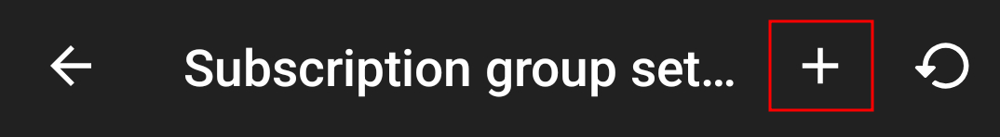

# Config

This repository contains v2ray configs that are expected to work to bypass the internet block in Iran.

> There is no guarantee that all the configs work for everyone.

## How the configs are selected

I copy and test a lot of configs (more than 2000) from various Telegram channels. The latency test URL is https://telegram.org/, and the ISP is MCI.

I don't remove the configs info tags, and strongly suggest to join the providers' channels.

> YOU **SHOUD NOT** RELY ON ME TO ALWAYS UPDATE THIS REPO. THIS REPO MAINLY SERVES AS A MORE COMFORTABLE TOOL TO HAVE WORKING CONFIGS ON MULTIPLE DEVICES OF "MINE"!

> I **DO NOT** OWN THE CONFIGS. I **AM NOT** RESPOSIBLE FOR ANY DAMAGE OR LOSS MADE BY THESE CONFIGS. I **AM NOT** A VPN PROVIDER.

## How to use

- [Android](#android)
- [Desktop](#desktop)

### => ***Android***

Download v2rayNG from here: https://github.com/2dust/v2rayNG/releases/latest

You'll see something like this:

You can download the release that matches your phone CPU architecture, or just simply download the `universal` version.

> v2rayNG has been removed from Google Play Store. Don't try to find it there.

**Follow the steps below:**

1. Open the app and click on the menu.

    

2. Open the subscription menu.

    

3. Add a new subscription.

    

4. Provide a name in "remarks" (the first rectangle) and copy this link to the "Optional URL (the second rectangle): `https://raw.githubusercontent.com/snaCW/Config/main/config.txt`

    

5. Once you filled the info, save the subscription. If you go to the app main window, you can see the subscription. Open this subscription menu.

    

6. From now on, you only need to click on "Update current group subscription". Every time you click on it, the subscription would be updated automatically.

    

### => ***Desktop***

Download Nekoray from here: https://github.com/MatsuriDayo/nekoray/releases/latest

You'll see something like this:

If you're on Windows, find the release with **windows64** name in it. Extract the compressed file and just run `nekobox.exe`, no need to install anything.

If you're on linux, you already know which one you should download.

**Follow the steps below:**

1. Open the groups settings.

    

2. Click on "new group" and change the "Type" to "Subscription". This is the link you should put in the URL field: `https://raw.githubusercontent.com/snaCW/Config/main/config.txt`

    

3. On the app main window, right-click and select "Current Group" and then click on "Update subscription". From now on, you should only click on this option. The configs would be automatically updated.

    